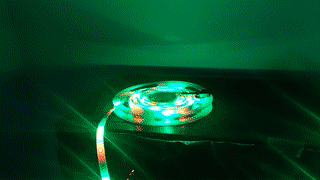

# RGBStrip

RGBStrip can be used to control 2835 and 5050 non-addressable LED strips using an ESP-8266 microcontroller and three output pins, assuming a common anode setup.

The RGBStrip class is based on [RGBLed by wilmouths](https://github.com/wilmouths/RGBLed) with the addition of some presets and intends to be nonblocking using a different approach (_millis()_ function instead of _delay()_ and number of steps as argument).


<div align="center">
  <figure>
  <br>
  <figcaption>Rainbow effect using RGBStrip</figcaption>
  </figure>
</div>

## Installing

[Using Arduino IDE](https://www.arduino.cc/en/Guide/Libraries)

[Using PlatformIO](https://www.youtube.com/watch?v=EBlHNBNHESQ)

## Usage

One can program an ESP-8266 microcontroller using the example main file included or use it as reference.

Starting from an empty sketch, don't forget to include the RGBStrip library using

```C++
#include <RGBStrip.h>
```

Then declare an instance of the RGBStrip class

```C++
RGBStrip strip(RED_PIN, GREEN_PIN, BLUE_PIN);
```
Where _RED_PIN_, _GREEN_PIN_ and _BLUE_PIN_ are the pin numbers assigned to each of the color segments of the strip.

## Methods

#### setColor
```C++
strip.setColor(red, green, blue);
```
  Lights the strip with the chosen values for red, green and blue.

#### off
```C++
strip.off();
```
  Lights the strip with 0 red, 0 green and 0 blue, essentially turning all the lights off.

The following methods should be constantly called, but are non-blocking in their nature:

#### blink
```C++
strip.blink(red, green, blue, onTime, offTime);
```
  Lights the strip with the chosen values for red, green and blue, turning on and off for the desired time (in ms).

#### fadeIn / fadeOut
```C++
strip.fadeIn(red, green, blue, time);
strip.fadeOut(red, green, blue, time);
```
  Fades the strip in/out using a sine easing function.

#### breathe
```C++
strip.breathe(red, green, blue, inTime, outTime);
```
  Combines fadeIn and fadeOut, creating a breathing effect.

#### shift
```C++
strip.shift(redStart, greenStart, blueStart, redEnd, greenEnd, blueEnd, time);
```
  Shifts between two colors using a sine easing function.

#### rainbow
```C++
strip.rainbow(shiftTime);
```
  Shifts between all the colors of the rainbow.

#### siren
```C++
strip.siren(shiftTime);
```
  Shifts between full red and full blue, creating a police siren effect.

## Colors

```C++
RGBStrip::COLOR
```

RGBStrip comes with some predefined colors: 
- RED
- GREEN
- BLUE
- YELLOW
- CYAN
- MAGENTA
- ORANGE
- WHITE

All methods accept predefined colors:

```C++
strip.breathe(RGBStrip::CYAN, 2000, 3000);
```
